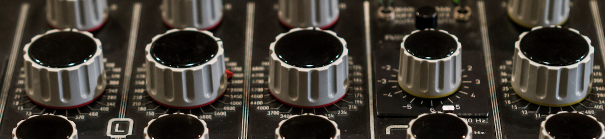

Photo: [*The Bunker*](https://www.thebunkerstudio.com/)

# The Sound of Science

### The Problem

The advent of affordable tools for home recording over the last 20 years has made music creation more accessible than ever before. Simultaneously, social media platforms such as Instagram and Facebook have made it similarly cheap and easy to advertise yourself to a targeted audience. However, most budding musicians, and even seasoned industry veterans, don't always know the best way to reach new fans; the *how*, *who*, and *where* questions always loom tall when it's time for a new release.

**In this study, I intend to create a recommender system to show similarities between the music of a new artist and that of popular artists around the globe, in order to generate basic recommendations to best connect new artists with new fans. I'll base this model on data from hundreds of thousands of songs hosted on the popular streaming platform Spotify, along with metrics I'll extract from a new artist's music using a Python library called Librosa.**

---
### Contents
| Notebook | File Name | Description |
|----|----|----|
|**1**|[01_data_collection_and_cleaning.ipynb](code/01_data_collection_and_cleaning.ipynb)|Spotify data imports, collection, and cleaning, and final Spotify dataframe export|
|**2**|[02_feature_engineering_and_comparisons.ipynb](code/02_feature_engineering_and_comparisons.ipynb)|Spotify dataframe feature selection and engineering; metric comparisons between Spotify and Librosa|
|**3**|[03_EDA.ipynb](code/03_EDA.ipynb)|Exploratory data analysis and visualizations|
|**4**|[04_recommeder_sys.ipynb](code/04_recommeder_sys.ipynb)|Recommender system based on Spotify metrics and Librosa-generated metrics|
|**5**|[05_appendix.ipynb](code/05_appendix.ipynb)|Appendix with examples of questionable Spotify and Librosa metrics, caveats, and glossary|

---
### Datasets Used

* Spotify Song Data from [Kaggle](https://www.kaggle.com/yamaerenay/spotify-dataset-19212020-160k-tracks?select=data.csv)
* Data I collected via [Librosa](https://librosa.org/doc/latest/index.html#), a Python library for audio and digital signal processing (*DSP*)

---
### Background & Research

With over 15 years of experience in the music industry, first as a musician and performer, and later as a sound designer, audio engineer, and producer, I believe I'm in a unique position to address this problem. I have an intimate knowledge of the process of creating music and much of the theory behind it on both sides of the mixing board, as well as the struggles of finding and connecting with your target audience as a new artist. You can find more information about my history in the industry on [LinkedIn](https://www.linkedin.com/in/awzucker/), and samples of my recent work as part of a collaborative project called [NO EVENS](https://noevens.com/).

I'm also fortunate enough to have many long-time friends in the industry, two of whom I spoke to regarding this project: [Jacob Bergson](https://www.tautmusic.com/), an independent musician and audio engineer at [The Bunker](https://www.thebunkerstudio.com/) recording studio in Brooklyn, NY, and [Joseph Kelley](https://www.linkedin.com/in/jjkelley/), the former Executive Director of Artist Relations at [Billboard](https://www.billboard.com/). Jacob was able to provide me with excellent insight on his extensive experience engineering multiple genres of music, which helped immensely as I decided how to engineer my own metrics to represent some of the more intangible qualities of music. Joe, on the other hand, has a wealth of knowledge to offer on the business landscape of the music industry: where and among what demographics artists are trending, what makes artists stand out in a digital landscape where anyone can easily post their music online, and so on.

---
### Scope

This project is a product of my immense passion for music and the process of creating and capturing it for posterity. The ultimate vision for this project is to create a user-facing app allowing anyone and everyone to upload their music, and in return, get a list of artists and songs that their music most closely resembles. From there, I intend to incorporate global listening trend data - where and to what demographic in each geographical region those similar artists are generating large numbers of streams, sales, and mentions on social media. This would ideally take the form of an interactive map, where the artist could see density and distribution of potential fans around the globe, with more granular demographic and trend data available at a click.

Due to data accessibility and time constraints, the following notebooks contain the first iteration of the recommender system to determine similarity between an "unheard" song and roughly 60,000 songs collected from Spotify (via [Kaggle](https://www.kaggle.com/yamaerenay/spotify-dataset-19212020-160k-tracks?select=data.csv)). I certainly hope it gives you some small picture as to what I hope to achieve!

Throughout this project, I also learned that quite a bit of the currently available audio data, in the form of statistical metrics, is flawed to some extent. This is, of course only in my opinion, which is precisely the point - so many qualities of how humans perceive and emotionally react to music are subjective. One song could be in the key of A minor, have a tempo of 107 beats per minute, a 4/4 time signature, an RMS loudness of -8dBF, the same instrumental-to-vocal ratio, and still sound nothing like another song with those exact same metrics. Through my exploration of Spotify's data and the metrics I generated with the help of the Python library [Librosa](https://librosa.org/), I've formed the opinion that, while some of music's intangibles will forever remain intangible, a careful and collective consideration of the intersections the ways in which computers experience music and how that relates to the human experiene of it has amazing potential to help connect artists with fans.

---
### Analysis Summary

*

---
### Conclusions & Considerations

*

---
### Looking to the Future

* Spotify is available in 92 countries, and is only one of many streaming platforms, let alone means of consuming music. For the purposes of this course, the scope had to be narrower than I’d like. I’d love more data on global music listening patterns, including other major domestic and foreign streaming platforms. I’d eventually like to incorporate data from popular blogs and local music publications from around the world!
* Ideally, it would be amazing if I could process spectrograms as images with a convolutional neural network, and compare their similarity that way. This could take immense computing power, and would require me to generate a dataframe of spectrograms (or matrices representing those spectrograms), as Spotify does not provide this data. I think to really implement this, however, I’d need very high resolution spectrograms - perhaps higher resolution than what we can currently generate, though this requires more research.
* Along these lines (and extractable from a spectrogram), I’d like to have numeric data for the frequency range for every track. Most modern music spans roughly the range of human hearing, from 20Hz to 20kHz (though there are usually subtle roll-offs at the extremes of this spectrum for the purposes of reproduction). The further back in time you go, the narrower that frequency range gets, due to constraints of the media used at the time, and a phenomenon known as generation loss, wherein the transfer of recordings from multitrack mixdown tapes to master tapes to the master plate, or the mold from which production runs of vinyl were cut. Still, one could expect most music professionally recorded post-1960 to have a frequency range of at least 100Hz to 10kHz. Having this data would enable me to efficiently automate the filtering of speech and other non-music recordings (e.g., in the case of a recording with a bandwidth of 300Hz to 5kHz).
* Perhaps another, more universal approach would be to gather data from popular music blogs, then generate a dataframe of more concrete metrics for these songs. This would require quite a bit of time, because I’d have to amass a history of posts from hundreds of blogs around the world, compile the thousands of resulting songs, then pass them all through Librosa to generate numeric features.
* A final note on *genre*: Built with data from Spotify, the web app [Every Noise at Once](http://everynoise.com/engenremap.html) displays the **5139 genres** of music currently represented on the streaming platform. Based on this ever-growing number, and with over 15 years of experience in the music industry as an artist, writer, and engineer, I’ve come to believe that the concept and subjectivity of genre has failed to adequately classify and capture the nuance of music created around the world: especially as it relates to marketing your music as a new artist. I believe a better way to approach marketing for a new artist is to use a range of sonic metrics to compare the statistical similarity of that artist’s material to globally trending artists and songs. In doing so, I hope to isolate locations and demographics in which comparable music performs well, thus boosting the efficacy of inexpensive (Instagram and Facebook ads), independent, artist-led marketing campaigns.

---
### Sources:
* Spotify Track Data from [Kaggle](https://www.kaggle.com/yamaerenay/spotify-dataset-19212020-160k-tracks?select=data.csv) (generated by Spotify)
* [Spotify API](https://developer.spotify.com/documentation/web-api/reference/)
* [Librosa & Librosa Documentation](https://librosa.org/doc/latest/index.html)
* [Every Noise At Once](http://everynoise.com/engenremap.html)
* [*Recommendation Systems: Principles, Methods and Evaluation*](https://www.sciencedirect.com/science/article/pii/S1110866515000341), F.O. Isinkaye, Y.O. Folajimi, B.A. Ojokoh
* [*What's Key For Key? The Krumhansl-Schmuckler Key-Finding Algorithm Reconsidered*](http://davidtemperley.com/wp-content/uploads/2015/11/temperley-mp99.pdf), David Temperley
* [*Key-Finding Algorithm*](http://rnhart.net/articles/key-finding/), Robert Hart
* Jacob Bergson ([artist](https://www.tautmusic.com/) and engineer at [The Bunker](https://www.thebunkerstudio.com/) studio)
* Matt Zucker (cellist with the [House of Time](https://www.houseoftimemusic.org/mattzucker) Baroque ensemble, MFA in cello performance from the [Eastman School of Music](https://www.esm.rochester.edu/) and MFA in Baroque music from [The Juilliard School](https://www.juilliard.edu/))
* Joseph Kelley (former Director of A&R at [Billboard](https://www.billboard.com/))
* [Valerio Velardo](https://valeriovelardo.com/), expert on AI Audio and Digital Signal Processing
* [*What Data Science Can Tell Us About Mainstream Music*](https://towardsdatascience.com/what-data-science-can-tell-us-about-mainstream-music-e56b20e00a25) by Ishan Nagpal on Medium
* 15+ years of personal experience as a sound designer, audio engineer, musician, and producer, and a lifetime love of recorded sound
